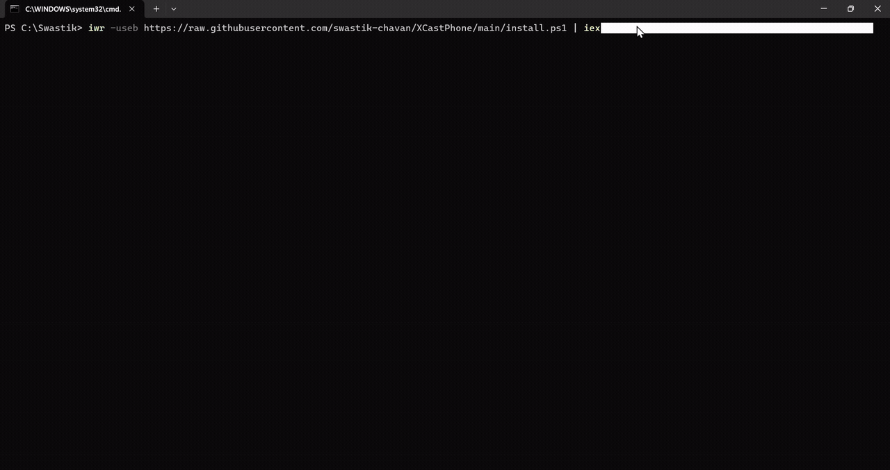
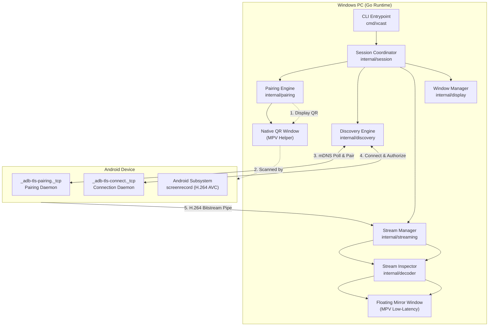

# XCastPhone

Wireless Android screen casting from your terminal — no companion Android app required.

[](https://golang.org)
[](https://github.com/swastik-chavan/XCastPhone)
[](https://opensource.org/licenses/MIT)
[](https://github.com/swastik-chavan/XCastPhone/releases)

---

## 1. Overview

**XCastPhone** is a terminal-first screen-casting tool for Windows that mirrors an Android device wirelessly onto your PC without installing any custom Android application or APK.

Instead of requiring user accounts, third-party companion apps, or cloud relay servers, XCastPhone connects directly using Android's native **Wireless Debugging** subsystem (ADB over TLS). 

When launched from PowerShell or Command Prompt, XCastPhone generates a mathematically square, integer-scaled QR code in a dedicated desktop window. Scanning this QR code inside Android's **Wireless debugging** settings establishes a mutual TLS pairing session. Once authorized, XCastPhone captures the display bitstream via native hardware encoding and streams it in real time into a floating, aspect-ratio-preserving desktop mirror window.

---

## 2. Why XCastPhone?

Most screen-mirroring utilities suffer from common architectural compromises:
* **Invasive Companion Apps**: Many tools require side-loading an APK onto the phone, managing background accessibility services, or accepting broad permissions.
* **Account & Cloud Dependencies**: Commercial tools frequently route video streams through remote servers, enforce account logins, or watermark free tiers.
* **Heavy Desktop Footprints**: Solutions built with Electron or web runtimes consume substantial memory and introduce input/render latency.

XCastPhone approaches the problem from a developer-first perspective:
* **Zero Phone Modifications**: Uses the standard Android Wireless Debugging protocol built into Android 11+.
* **Terminal-First Workflow**: Start, monitor, and terminate sessions directly from the command line with `xcast`.
* **Local-Only Network Path**: Video frames are transferred directly over your local Wi-Fi network without leaving your local subnet.
* **Native Lightweight Executable**: Written in Go with minimal dependencies, providing immediate startup and low resource consumption.

---

## 3. Features

* **Terminal-First Execution**: Run `xcast` with configurable flags for bitrate, framerate, scaling, and timeouts.
* **No Android Companion App**: Relies purely on stock Android Wireless Debugging; no APK side-loading or device tampering.
* **Dedicated Square QR Window**: Generates a high-contrast, integer-scaled, 1:1 square QR code (Level M error correction) in a native window for quick camera recognition.
* **Automated Two-Stage Discovery**:
  * Automatically detects `_adb-tls-pairing._tcp` services to authenticate the 6-digit pairing code.
  * Discovers `_adb-tls-connect._tcp` connection services and manages dynamic port assignment.
* **Floating Mirror Window**: Aspect-ratio-preserving, borderless window with GPU-accelerated low-latency playback powered by MPV.
* **Screen-Off Detection**: Continuously monitors the physical display state via Android power management and terminates the session cleanly when the phone screen turns off.
* **First-Frame Synchronization**: Confirms H.264 stream ingestion and NAL packet validation before declaring the session active.
* **Diagnostic Mode**: Headless capture verification (`xcast --test-stream`) and verbose performance metrics (`xcast --debug`).

---

## 4. Demo

The following recording demonstrates the complete end-to-end workflow: starting XCastPhone from the terminal, scanning the dedicated square QR code using Android Wireless Debugging, automatic service discovery, and live low-latency screen casting into the floating mirror window.

<div align="center">



*Live wireless screen casting from terminal into floating portrait mirror window.*

<sub>Full-resolution recording available at [`assets/Video-Xcast.mp4`](assets/Video-Xcast.mp4)</sub>

</div>

---

## 5. How It Works

The XCastPhone pipeline operates in discrete, verifiable stages:

```text
               +-------------------------------------------+
               |                 xcast                     |
               +---------------------+---------------------+
                                     |
                                     v
                       +---------------------------+
                       | Generate Pairing Session  |
                       | & Launch Native QR Window |
                       +-------------+-------------+
                                     |
               (Android Settings -> Wireless Debugging -> Pair)
                                     |
                                     v
                       +---------------------------+
                       |   mDNS Discovery Stage    |
                       |   _adb-tls-pairing._tcp   |
                       +-------------+-------------+
                                     |
                                     v
                       +---------------------------+
                       |     adb pair <ip:port>    |
                       | (Mutual TLS Authentication)
                       +-------------+-------------+
                                     |
                                     v
                       +---------------------------+
                       |   Close QR Pairing Window |
                       +-------------+-------------+
                                     |
                                     v
                       +---------------------------+
                       |   mDNS Discovery Stage    |
                       |   _adb-tls-connect._tcp   |
                       +-------------+-------------+
                                     |
                                     v
                       +---------------------------+
                       |    adb connect <ip:port>  |
                       |   (Device Authorization)  |
                       +-------------+-------------+
                                     |
                                     v
                       +---------------------------+
                       | Android Screenrecord (H264|
                       |  Hardware AVC Bitstream)  |
                       +-------------+-------------+
                                     |
                                     v
                       +---------------------------+
                       |   PC Transport Stream     |
                       | (StreamInspector / NAL)   |
                       +-------------+-------------+
                                     |
                                     v
                       +---------------------------+
                       |   Floating Mirror Window  |
                       | (GPU Low-Latency Pipeline)|
                       +---------------------------+
```

### Stage Separation
1. **QR Pairing Window**: A temporary, standalone display window opened strictly to render the high-resolution QR pairing payload. Closing this window automatically cancels pending pairing. Once paired, XCastPhone closes this window automatically.
2. **Mirror Window**: The primary video rendering surface created once the device is authorized and the video pipeline is verified. Closing this window terminates the active casting session.

---

## 6. Requirements

### PC Requirements
* **Operating System**: Windows 10 or Windows 11 (64-bit / ARM64).
* **Shell**: PowerShell 5.1+ or PowerShell 7+ (Command Prompt supported via PowerShell invocation wrapper).
* **Network**: Active local area network (Wi-Fi or Ethernet on the same subnet as the Android device).
* **Dependencies**:
  * Android Platform Tools (`adb`) — Automatically downloaded by the installer if not detected.
  * MPV video player — Bundled and configured automatically in `%USERPROFILE%\.xcast\bin`.

### Android Requirements
* **Android OS**: Android 11.0 (API 30) or higher (required for native Wireless Debugging QR pairing).
* **Developer Options**: Must be enabled (**Settings** → **About phone** → tap **Build number** 7 times).
* **Wireless Debugging**: Toggled **ON** in Developer Options.
* **Network**: Connected to the same local Wi-Fi network as the PC (client isolation must be disabled on the router).

---

## 7. Installation

### Quick Install (PowerShell)

Open Windows PowerShell (Run as standard user or Administrator) and run:

```powershell
iwr -useb https://raw.githubusercontent.com/swastik-chavan/XCastPhone/main/install.ps1 | iex
```

### Command Prompt (CMD)

Because `iwr` is a PowerShell-specific alias, run the wrapper command if you are using standard `cmd.exe`:

```cmd
powershell -ExecutionPolicy Bypass -Command "iwr -useb https://raw.githubusercontent.com/swastik-chavan/XCastPhone/main/install.ps1 | iex"
```

The installer will:
1. Detect system architecture (`amd64` / `arm64`).
2. Download and verify the latest `xcast.exe` binary.
3. Verify or automatically install standard Platform Tools (`adb.exe`) and the low-latency renderer (`mpv.exe`).
4. Install all binaries to `%USERPROFILE%\.xcast\bin`.
5. Add `%USERPROFILE%\.xcast\bin` to your User `PATH` environment variable.

---

## 8. First-Time Setup

To pair your Android device with XCastPhone for the first time:

1. **Enable Developer Options on Android**:
   * Navigate to **Settings** → **About phone**.
   * Scroll down and tap **Build number** 7 times until you see the message *"You are now a developer!"*.

2. **Enable Wireless Debugging**:
   * Go to **Settings** → **System** (or **Additional settings**) → **Developer options**.
   * Scroll to the **Debugging** section and toggle **Wireless debugging** to **ON**.
   * Check *"Always allow on this network"* when prompted.

3. **Open the QR Pairing Menu**:
   * Tap on the text **Wireless debugging** to enter the sub-menu.
   * Tap **Pair device with QR code**.
   * A camera viewfinder labeled *"Pair with QR code"* will appear on your phone.

> [!WARNING]
> **Do NOT scan the QR code using your standard Android Camera app or Google Lens.**
> 
> The QR payload begins with `WIFI:T:ADB;S:...;P:...;;`. Standard Android camera applications interpret any QR code starting with `WIFI:` as a Wi-Fi Access Point and attempt to disconnect your phone from your router to connect to a non-existent network.
> 
> You must scan the QR code exclusively from within:
> **Android Settings → Developer options → Wireless debugging → Pair device with QR code**.

---

## 9. Usage

### Standard Mirroring

Launch XCastPhone from any terminal:

```powershell
xcast
```

### Expected Output Sequence

```text
==========================================
       XCastPhone Wireless Pairing        
==========================================

Scan this QR code using:

Android Settings
→ Developer options
→ Wireless debugging
→ Pair device with QR code

[QR WINDOW]

[PAIR] Waiting for Android QR pairing...
[PAIR] Pairing service detected: 192.168.X.XXX:45727
[PAIR] Running ADB pairing...
[PAIR] Pairing successful.
[DISCOVERY] Waiting for ADB connection service...
[DISCOVERY] Device service detected: 192.168.X.XXX:43815
[ADB] Connecting to 192.168.X.XXX:43815...
[ADB] Device authorized.

XCastPhone

Device:     Samsung SM_E135F
Resolution: 1080x2408
FPS:        60
Status:     Connected

[STREAM] Initializing...
[STREAM] Renderer initialized.
[STREAM] Decoder initialized.
[STREAM] Mirror window created.
[STREAM] Starting Android capture...
[ANDROID] Capture process started (PID: 23904)
[STREAM] Transport connected.
[STREAM] Waiting for first frame...
[STREAM] First frame received.
Casting... (Press Ctrl+C to terminate)
```

### Terminating a Session
* Press `Ctrl+C` in your terminal, **or**
* Close the floating mirror window, **or**
* Turn off your phone's physical screen (detected automatically via power subsystem).

---

## 10. CLI Options

| Flag | Type | Default | Description |
| :--- | :--- | :--- | :--- |
| `-bitrate` | int | `8` | Video streaming bitrate in Mbps (e.g. `8` for 8 Mbps). |
| `-fps` | int | `60` | Target rendering frame rate in frames per second. |
| `-max-size` | int | `2400` | Maximum screen dimension in pixels (scales down if larger). |
| `-timeout` | int | `90` | Pairing and discovery timeout in seconds. |
| `-verbose` | bool | `false` | Enables verbose diagnostic output for transport events. |
| `-debug` | bool | `false` | Enables real-time stream throughput, frame rate, and process logs. |
| `-test-stream`| bool | `false` | Runs a 3-second headless capture test without opening a UI window. |
| `-version` | bool | `false` | Prints XCastPhone version and exits. |
| `-help` | bool | `false` | Displays help message and CLI options. |

### Example Invocations

```powershell
# Cast at a custom bitrate of 12 Mbps and target 60 FPS
xcast -bitrate 12 -fps 60

# Run in debug mode to monitor throughput and frame delivery
xcast --debug

# Test capture and network transport without launching the display window
xcast --test-stream
```

---

## 11. Supported Devices & Platforms

* **Host PC**: Windows 10 and Windows 11 (tested on `x86_64` and `arm64`).
* **Android Devices**: Compatible with Android 11, 12, 13, 14, and 15+ devices with Wireless Debugging support, including:
  * Google Pixel series
  * Samsung Galaxy (One UI)
  * Xiaomi / Redmi / POCO (MIUI / HyperOS)
  * OnePlus / Oppo / Realme (OxygenOS / ColorOS)
  * Motorola, Sony, and generic AOSP builds
* **Hardware Video Decoders**: Requires modern graphics drivers supporting Direct3D/Vulkan or OpenGL video acceleration.

> Compatibility depends on Android's Wireless Debugging and ADB implementation on the specific device firmware.

---

## 12. Performance Expectations

* **Target Frame Rate**: Designed to target up to 60 FPS over a stable 5 GHz Wi-Fi connection.
* **Resolution**: Default scaling adapts to the phone's native panel (e.g. 1080×2408 scaled to standard hardware encoder bounds).
* **Latency**: Actual latency is influenced by:
  1. The Android device's hardware AVC/H.264 encoder implementation.
  2. Local Wi-Fi router congestion, channel interference, and signal strength (5 GHz is strongly recommended).
  3. Host GPU decoding throughput.

*XCastPhone does not claim "zero latency" or "lossless compression"; video is compressed via hardware H.264 bitstream over local IP transport.*

---

## 13. Limitations

* **Mirroring Only**: XCastPhone is an audio/video presentation tool; it does not currently inject mouse clicks or keyboard inputs back to the phone.
* **Audio**: Stock Android `screenrecord` captures video bitstreams only. System audio is not mirrored over the video pipeline.
* **DRM-Protected Content**: Applications using Android's `FLAG_SECURE` (such as banking apps or protected video streaming services) will display a black screen by design of the Android operating system.
* **Client Isolation**: Guest or enterprise Wi-Fi networks that enforce client isolation will block peer-to-peer mDNS discovery. Use your phone's personal mobile hotspot as a direct Wi-Fi network if client isolation cannot be disabled.

---

## 14. Troubleshooting

### `iwr is not recognized as an internal or external command`
You are executing the command inside standard Command Prompt (`cmd.exe`) rather than PowerShell. Run:
```cmd
powershell -ExecutionPolicy Bypass -Command "iwr -useb https://raw.githubusercontent.com/swastik-chavan/XCastPhone/main/install.ps1 | iex"
```

### Phone Wi-Fi turns off / disconnects when scanning QR
You scanned the QR code using the normal Android camera app or Google Lens. Standard camera apps treat `WIFI:` prefixes as a Wi-Fi Access Point SSID.
* **Solution**: Only scan from inside **Android Settings** → **Developer options** → **Wireless debugging** → **Pair device with QR code**.

### QR window opens but phone shows "Pairing failed"
* Verify that your PC and phone are connected to the exact same Wi-Fi router or access point.
* Verify that you did not switch Wi-Fi networks on either device during pairing.
* On your phone, tap **Revoke USB debugging authorizations** in Developer Options and toggle **Wireless debugging** OFF and back ON.

### Mirror window closes immediately after connecting
Run XCastPhone with the debug flag to inspect the underlying transport:
```powershell
xcast --debug
```
* Verify if your phone display was turned off when the stream started.
* Verify if the connection was terminated by checking the `[PROCESS]` and `[ANDROID]` log outputs.

### Diagnostic Verification
If you suspect transport or encoder issues, execute the standalone headless test:
```powershell
xcast --test-stream
```
* **Case A Failure**: Android capture failed to start (`0 bytes received`).
* **Case B Failure**: Transport received data, but no H.264 NAL headers were detected.
* **Case C Success**: Transport received data and decoded frames successfully.

---

## 15. Security & Privacy

* **100% Local Processing**: All video and control packets travel exclusively across your local network between the PC and Android device. No external servers or telemetry systems are involved.
* **Mutual Authentication**: ADB Wireless Debugging uses TLS with a randomly generated 6-digit one-time password and temporary service identifier per pairing session.
* **Explicit User Consent**: Wireless Debugging cannot be established silently; the phone user must manually initiate the QR scan inside Developer Options.
* **Trust Considerations**: Enabling Wireless Debugging gives the connected PC ADB-level permissions on the device. Disable Wireless Debugging when operating on untrusted or public networks.

---

## 16. Technical Architecture



---

## 17. Project Structure

```text
XCastPhone/
├── .gitignore
├── LICENSE
├── README.md
├── install.ps1                 # Official PowerShell installer
├── install.sh                  # POSIX installation script
├── go.mod                      # Go module definition
├── go.sum                      # Dependency checksums
├── assets/
│   ├── README.md
│   ├── demo.gif                # High-definition inline animated demo
│   └── Video-Xcast.mp4         # Official project demo recording
├── cmd/
│   └── xcast/
│       └── main.go             # Application CLI entrypoint and flags
├── internal/
│   ├── adb/
│   │   ├── client.go           # ADB CLI wrapper and exec-out stream handler
│   │   ├── device.go           # Device properties, resolution, and authorization
│   │   ├── device_test.go      # Device parsing unit tests
│   │   └── power.go            # Power and screen-state monitor (dumpsys)
│   ├── decoder/
│   │   ├── decoder.go          # H.264 NAL unit parser and stream throughput inspector
│   │   └── decoder_test.go     # Stream inspector unit tests
│   ├── discovery/
│   │   ├── discovery.go        # Two-stage mDNS pairing and connection state machine
│   │   └── discovery_test.go   # mDNS service parser unit tests
│   ├── display/
│   │   └── window.go           # Low-latency MPV window and native QR window manager
│   ├── pairing/
│   │   ├── pairing.go          # Temporary credential generator and square QR rasterizer
│   │   └── pairing_test.go     # Integer scaling and QR dimension unit tests
│   ├── session/
│   │   └── coordinator.go      # End-to-end lifecycle, signal handling, and teardown
│   └── streaming/
│       ├── streamer.go         # Android screen capture, pipe router, and diagnostics
│       └── streamer_test.go    # Resolution calculation unit tests
└── scripts/
    ├── install.ps1             # Installation script backup
    └── install.sh              # Shell script backup
```

---

## 18. Development

### Prerequisites
* Go 1.23 or newer
* Git
* Android Platform Tools (`adb.exe` in `PATH` or standard SDK location)
* MPV player (`mpv.exe` in `PATH` or `%USERPROFILE%\.xcast\bin`)

### Building from Source

```powershell
# Clone the repository
git clone https://github.com/swastik-chavan/XCastPhone.git
cd XCastPhone

# Run unit tests
go test -v ./...

# Compile the xcast binary
go build -v -o xcast.exe ./cmd/xcast

# Run with diagnostic logging
.\xcast.exe --debug
```

---

## 19. Contributing

Contributions to XCastPhone are welcome. Please adhere to these guidelines:
1. **Fork and Branch**: Create a feature branch off `main` for your changes.
2. **Preserve Architecture**: Maintain the terminal-first, zero-APK design philosophy. Do not introduce companion mobile apps, cloud relays, or heavy runtime frameworks.
3. **Validate Changes**: Ensure all unit tests pass (`go test -v ./...`) and test directly on physical Android hardware before submitting.
4. **Focused Pull Requests**: Keep pull requests focused on a single bug fix or feature enhancement.

---

## 20. License

This project is licensed under the [MIT License](LICENSE).
Copyright (c) 2026 XCastPhone Contributors.
